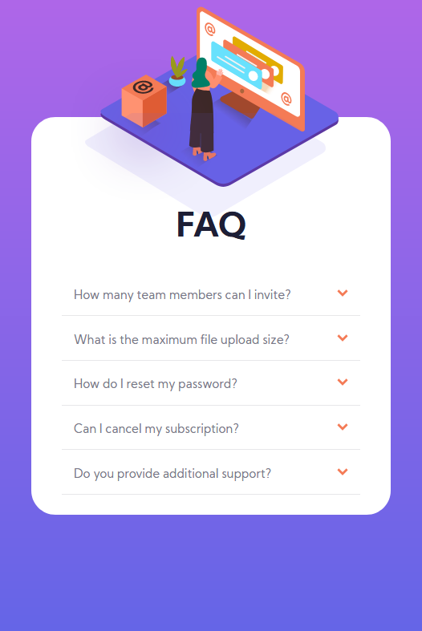
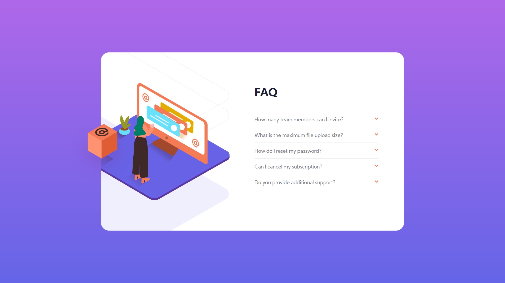

# Frontend Mentor - FAQ Accordion Card

This is a solution to the [FAQ Accordion Card](https://www.frontendmentor.io/challenges/faq-accordion-card-XlyjD0Oam). Frontend Mentor challenges help you improve your coding skills by building realistic projects. 

## Table of contents

- [Overview](#overview)
  - [The challenge](#the-challenge)
  - [Screenshot](#screenshot)
  - [Links](#links)
- [My process](#my-process)
  - [Built with](#built-with)
  - [What I learned](#what-i-learned)
  - [Continued development](#continued-development)
- [Author](#author)

## Overview

### The challenge

Users should be able to:

- View the optimal layout for the site depending on their device's screen size

### Screenshot
#### MOBILE LAYOUT:

#### DESKTOP LAYOUT:

### Links

- Solution URL: [https://www.frontendmentor.io/solutions/faqaccordioncard-DHLRJa__l]
- Live Site URL: [https://frontendmentor-faq.netlify.app/]

## My process

### Built with

- Semantic HTML5 markup
- CSS
- CSS Grid
- CSS Flex
- Mobile-first workflow

### What I learned
I learned about the importance to work with a correct standard to make a layout (flex or grid).
About element positioning. 

### Continued development
Behaviour about CSS pseudo class.
Flex and Grid layout.
Behaviour of the componentes positionated (relative/absolute)
Learn more about standars to declared CSS.

## Author
<h4>Gabo Pereyra</h4>

- GitHub - [@gabopereyra](https://github.com/gabopereyra)
- Frontend Mentor - [@gabopereyra](https://www.frontendmentor.io/profile/gabopereyra)
- Twitter - [@gabs_pereyra](https://twitter.com/gabs_pereyra)
